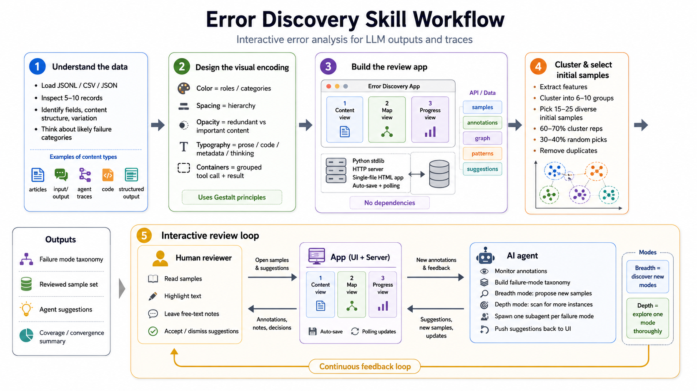

# Error discovery skill

This skill makes an AI agent run error analysis on a dataset. Point it at a
JSONL/CSV/JSON file of LLM outputs or traces, and it:

1. Reads the dataset and figures out the content type (articles, agent traces,
   code, structured output, etc.).
2. Designs visual encoding based on what varies in the data. Uses Gestalt
   principles (color for categories, spacing for hierarchy, opacity for
   importance).
3. Builds a single-file HTML review app served by a Python stdlib server. No
   dependencies.
4. Clusters the data and picks a diverse initial sample (cluster reps + random
   picks).
5. Runs an interactive loop: monitors annotations, categorizes failure modes,
   proposes new samples to increase coverage.



You read and leave free-text notes. The agent sorts them into failure modes,
tracks coverage, and picks new samples to fill gaps.

The full instructions are in `SKILL.md`.

## How to use it

`SKILL.md` is a plain markdown file. Any agent that can read a file can follow
it.

- Claude Code reads skills from `~/.claude/skills`. Clone the repo into a folder
  named `error-discovery`:

```
git clone https://github.com/shreyashankar/error-discovery-skill ~/.claude/skills/error-discovery
```

- Other agents can use the rules too. Paste the contents of `SKILL.md` into
  whatever instructions that agent reads.

Then point the agent at a dataset:

```
Can you help me do error analysis on traces.jsonl?
```
